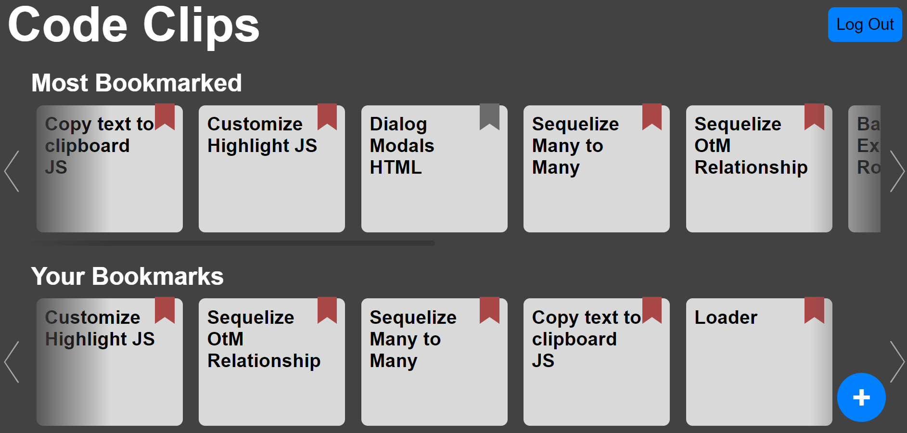

# CodeClips
Post and save code snippets for future reference.

[Deployed Application](https://code-clips.herokuapp.com/)
> Note: On November 28th, 2022, the Heroku free plans will be discontinued and the deployed application may no longer be available.

<div id="top"></div>

<!-- TABLE OF CONTENTS -->
<details>
  <summary>Table of Contents</summary>
  <ol>
    <li>
      <a href="#about-the-project">About The Project</a>
      <ul>
        <li><a href="#technologies-used">Technologies Used</a></li>
      </ul>
    </li>
    <li>
      <a href="#development">Development</a>
    </li>
    <li><a href="#installation">Installation</a></li>
    <li><a href="#usage">Usage</a></li>
    <li><a href="#contributors">Contributors</a></li>
  </ol>
</details>


<!-- ABOUT THE PROJECT -->
## About The Project



Managing the tabs upon tabs of documentation and references we use while coding was too much of a hassle. We wanted to create a tool for developers to be able to store bits of code, documentation, and references for future use.

<p align="right">(<a href="#top">back to top</a>)</p>


### Technologies Used

* [Node.js](https://nodejs.org/en/)
* [Express](https://expressjs.com/)
* [Sequelize](https://sequelize.org/)
* [Handlebars](https://handlebarsjs.com/)
* [Highlight.js](https://highlightjs.org/)
* [Browserify](https://browserify.org/)
* [Bcrypt](https://www.npmjs.com/package/bcrypt)


<p align="right">(<a href="#top">back to top</a>)</p>


<!-- GETTING STARTED -->
## Development

We began development by putting together a plan focused on a database schema. Once it was decided what the functionality of the application would look like we began to modularly build the application, each team member focusing on a specific aspect which would come together to produce a working final product. The primary challenge faced during this period were lapses in communication and the absence of a single shared vision. While the functionality needed from the application was made clear, the concept for the design and user interface was not as clearly communicated which hampered development, especially in the front-end.
The amount of progress lost to this "little" disconnect was a clear demonstration of just how important planning and communication is for a project and was a key takeaway for the group.

## Installation


1. Clone the repo
   ```sh
   git clone https://github.com/kwlucas/Code-Clips.git
   ```
2. Install NPM packages
   ```sh
   npm install
   ```
3. Run NPM start in the console
    ```sh
    npm start
    ```

<p align="right">(<a href="#top">back to top</a>)</p>


<!-- USAGE EXAMPLES -->
## Usage

Click on any of the posts to view its contents and code snippet.

Sign up and/or log in in order to save posts to the "Your Bookmarks" section.


Clicking the "Copy Code" button underneath a post's code snippet will copy the snippet to your clipboard.

Click the button with the plus sign to create a new post of your own.


While typing within the code snippet input field you can use the "tab" button to create indentations.

<p align="right">(<a href="#top">back to top</a>)</p>


<!-- CONTACT -->
## Contributors

* [Kyle Lucas](https://github.com/kwlucas)
* [Brendon Curry-Hobbs](https://github.com/brendonc-h)
* [Jose Martinez](https://github.com/joseeenrique)
* [Jessica Steinhaus](https://github.com/j-steinhaus)

Project link: [Repository](https://github.com/kwlucas/Code-Clips)

Deployed Application: [Code-Clips](https://code-clips.herokuapp.com/)

> Note: On November 28th, 2022, the Heroku free plans will be discontinued and the deployed application may no longer be available.

<p align="right">(<a href="#top">back to top</a>)</p>
